# メッシュでの評価
メッシュを用いた評価のざっくりとした結果です。

結論から言うと、dataset7（私が手動でパッチ画像を切り取った時）が最も大陸と雲の境目が存在するブロックを認識できていました。

###  注釈
すみません修論に追われていて細かい説明はこのあとコンパイルするlatexファイル本体に書き入れます。

"cospa_2008-2010_patch255_test2009.png" が示している情報
- cospa : cospaのモデルの結果
- 2008-2010：2008年と2010年の雲画像からパッチ画像を生成
- patch255:　パッチ画像サイズが255x255[px]
- test2009：テストデータ2009年に対しての結果

## テストデータにおける雲の出現率（全年度）
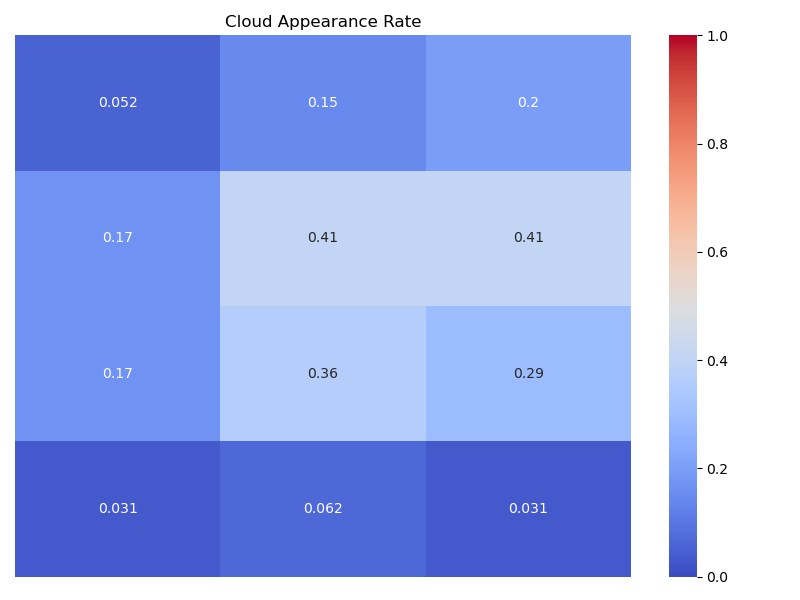

# 2008年と2010年と南極大陸に雲がかかっていない画像からパッチ画像を生成したとき
（私が手動で作ったデータセット）
### cospa, dataset7, patch255, test2008
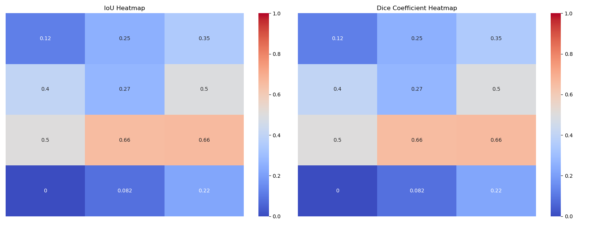

### cospa, dataset7, patch255, test2006
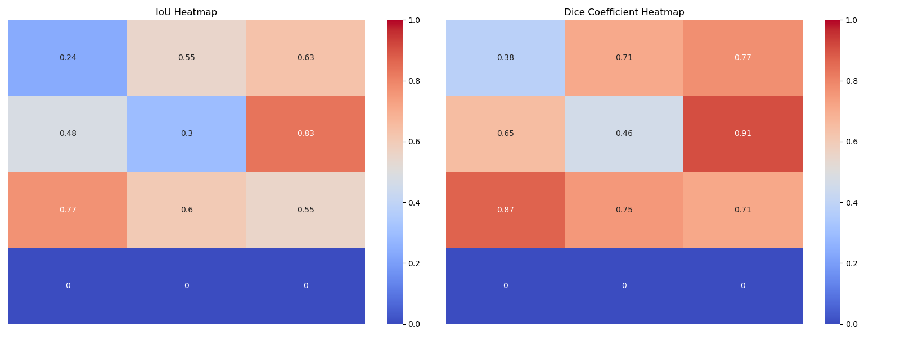

### cospa, dataset7, patch255, test2009
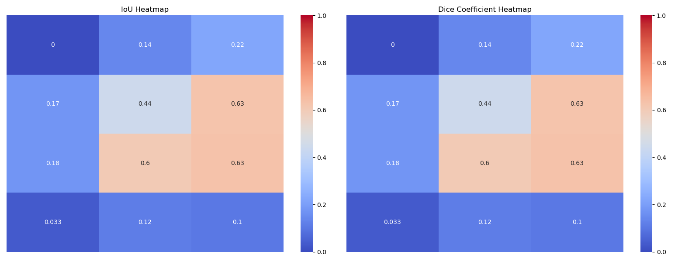

# 2008年の雲画像から生成したデータセットの結果
### cospa, 2008, patch255, test2008
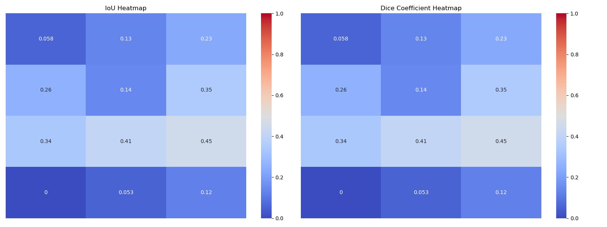

### cospa, 2008, patch255, test2006
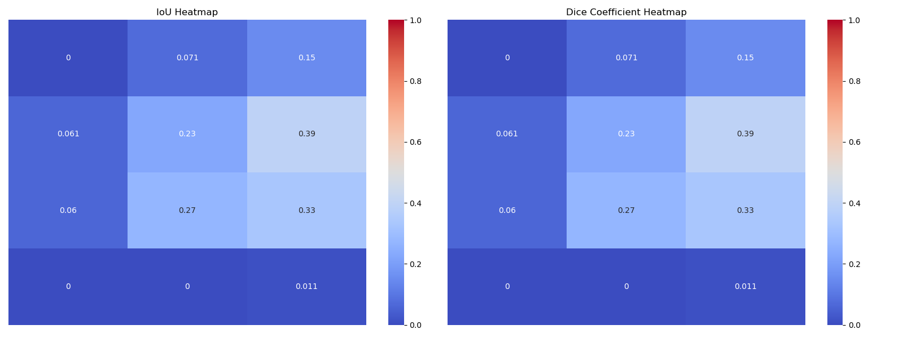

### cospa, 2008, patch255, test2009
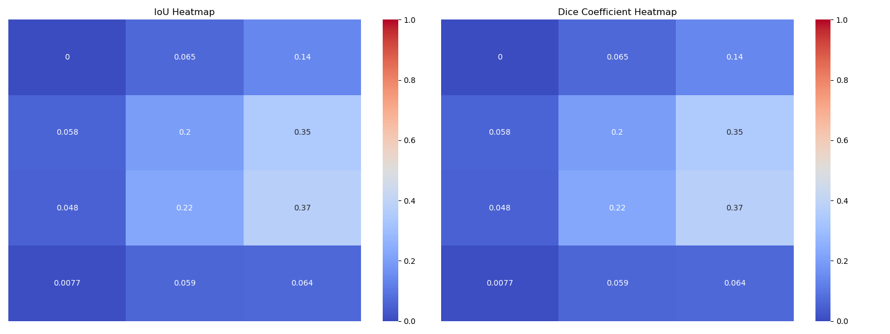

### cospa, 2008, patch127, test2008
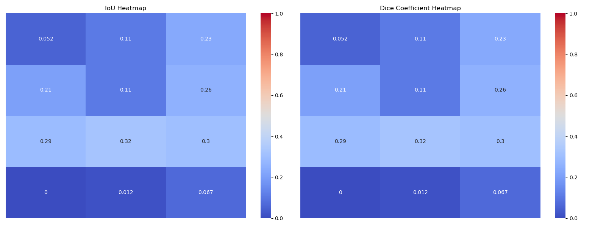

### cospa, 2008, patch127, test2006
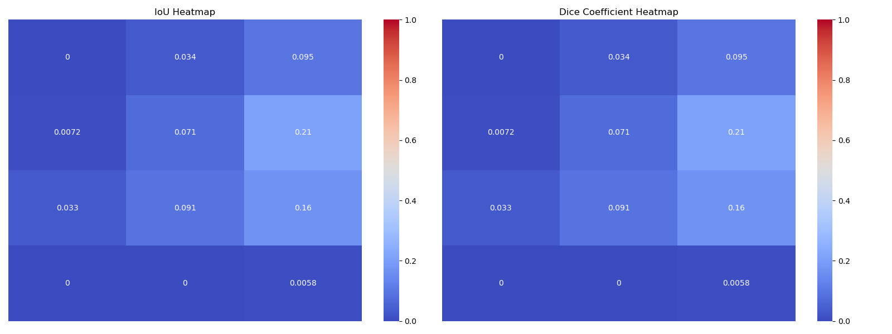

### cospa, 2008, patch127, test2009
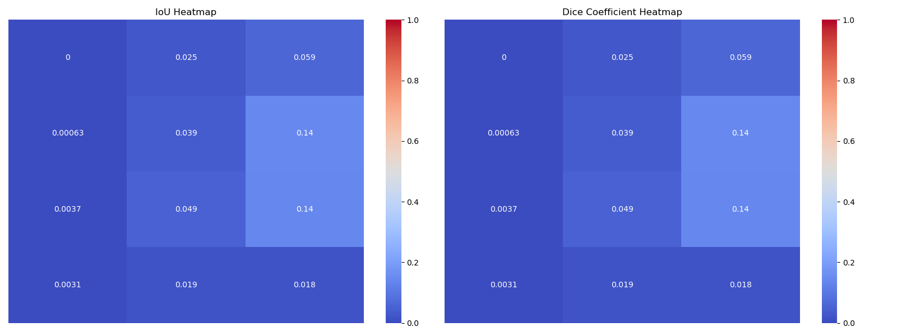

### cospa, 2008, patch63, test2008
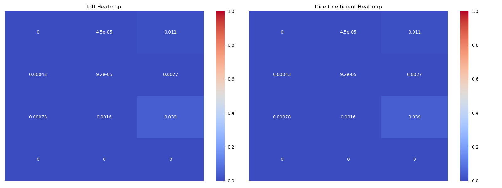

### cospa, 2008, patch63, test2006
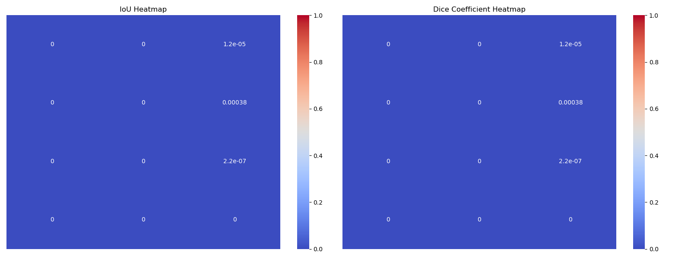

### cospa, 2008, patch63, test2009
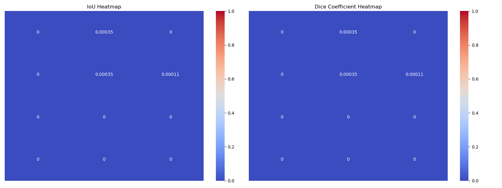

# 2008年と2010年の雲画像から生成したデータセットの結果

### cospa, 2008-2010, patch255, test2008-2010

### cospa, 2008-2010, patch255, test2006
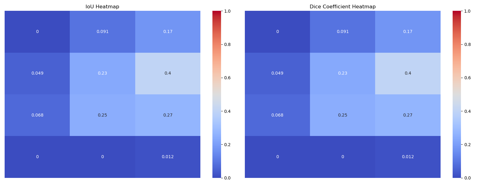

### cospa, 2008-2010, patch255, test2009
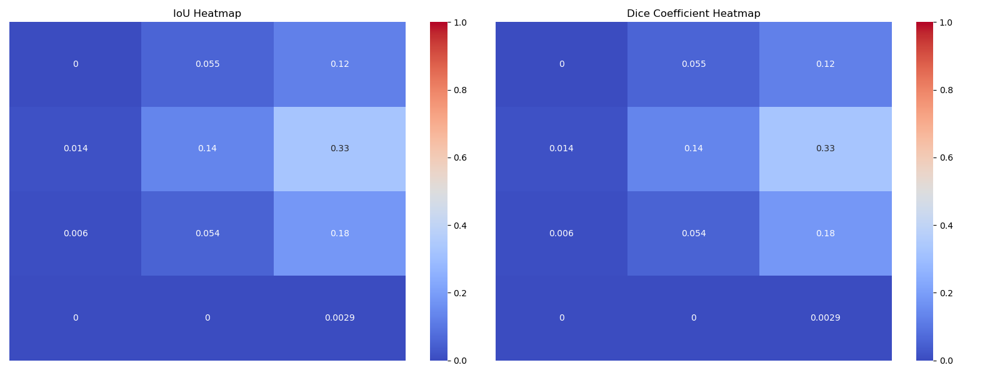

### cospa, 2008-2010, patch127, test2008-2010

### cospa, 2008-2010, patch127, test2006
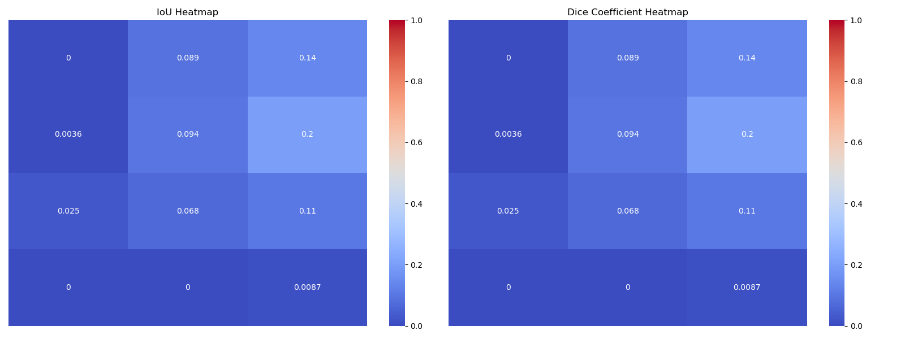

### cospa, 2008-2010, patch127, test2009
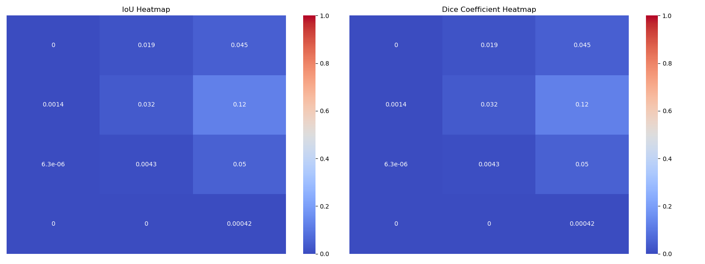

### cospa, 2008-2010, patch63, test2008-2010

### cospa, 2008-2010, patch63, test2006
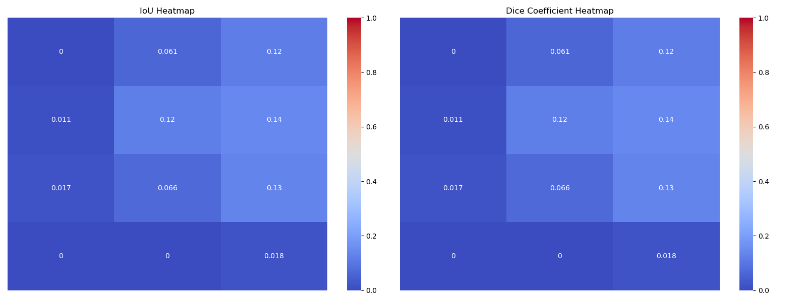

### cospa, 2008-2010, patch63, test2009
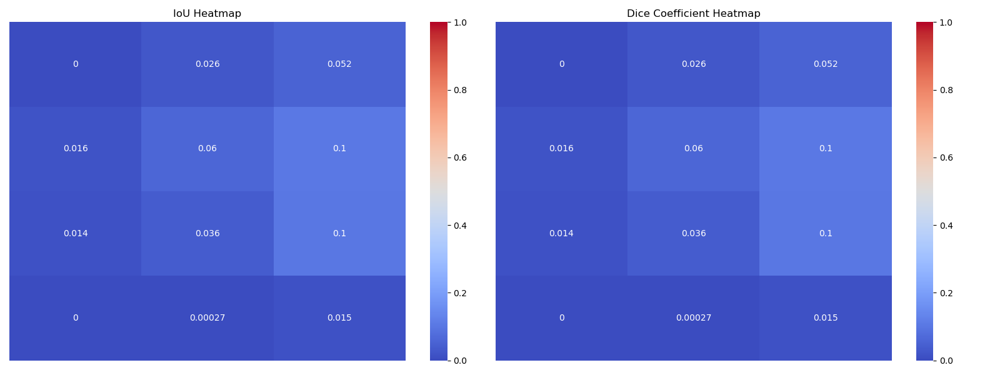
